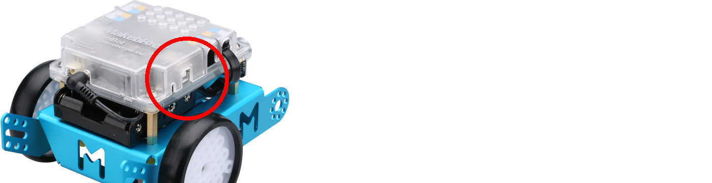
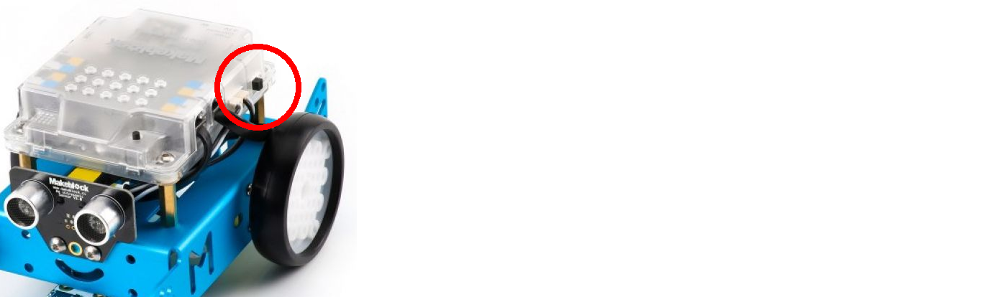
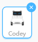
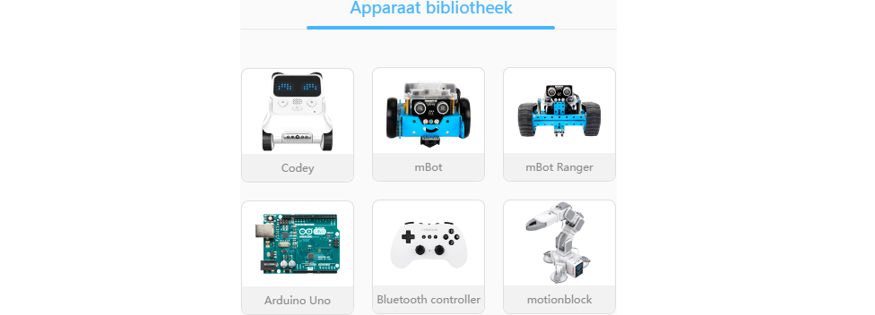
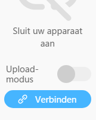
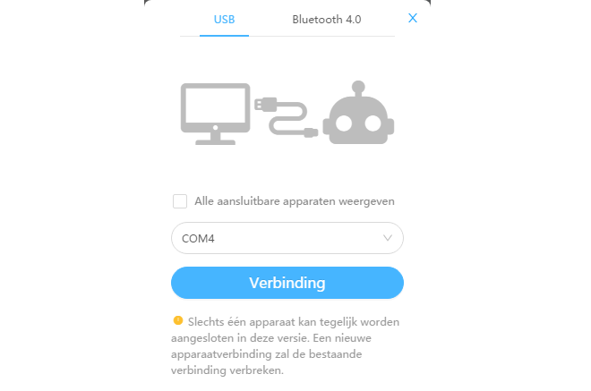
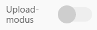

# Les 1: Blink

In deze les gaan we de allergemakkelijkste schakeling maken die er is: Blink!

 | Belangrijker is dat we leren hoe je een mBot aansluit
:-------------:|:----------------------------------------: 

## 1.1 Blink: een mBot aansluiten

Verbind de mBot met een computer met een USB kabel:

Zet de mBot aan. 

 | Als je vergeet de mBot aan te zetten, mislukt het uploaden
:-------------:|:----------------------------------------: 

\pagebreak

## 1.2 Blink: een mBot verbinden

 * Start mBlock met de mBlock snelkoppeling
 * Linksonderin zie je een gedeelte met 'Apparaten':
   Verwijder Codey, door op het kruisje te drukken. 
   Klik op OK om Codey echt weg te krijgen.

 | 
:------------------:|:------------------------------------------: 
mBlock snelkoppeling|Klik op het kruisje om Codey te verwijderen

 
 * Druk op de '+' om de 'Apparaat bibliotheek' te openen. Klik op mBot

                      | 
:-------------------------------------:|:---------------------------------------: 
Klik op OK om Codey echt weg te krijgen|Klik op mBot in de 'Apparaat bibliotheek'

 * Klik op 'Verbinden' om een verbinding the maken. Klik in de pop-up
   weer op 'Verbinden'

                     |
:---------------------------------------------:|:-----------------------------------: 
Klik op 'Verbinden' om een verbinding the maken|Klik in de pop-up weer op 'Verbinden'

 * Klik op 'Upload Modus' om de upload modus aan te zetten

Als de upload modus aan is, kunnen we programmeren!

 * Klik op 'Gebeurtenissen'

Gelukt!

\pagebreak

 | Als het gelukt is, ziet je scherm er zo uit als in plaatje 'Gelukt!'
:-------------:|:----------------------------------------: 

 | Als het gelukt is, ziet je scherm er zo uit als in plaatje 'Gelukt!'
:-------------:|:----------------------------------------: 

\pagebreak

## 1.3 Blink: alle LEDs branden rood

 * Maak je eerste programma 'alle LEDs branden rood':

 * Klik op 'Uploaden'

 | Als het gelukt is, gaan alle LEDs rood branden
:-------------:|:----------------------------------------: 

## 1.4 Blink: een andere kleur, opdracht

Schrijf een programma:

 * alle LEDs branden blauw

 | Tip: klik op de gekleurde punt rechts van 'toon kleur' in het 'LED all toon kleur rood' blok
:-------------:|:----------------------------------------: 

 | Heb je een hint nodig? Op de volgende pagina staat de oplossing!
:-------------:|:----------------------------------------: 

\pagebreak

## 1.5 Blink: een andere kleur, oplossing

## 1.6 Blink: rood dan groen, opdracht

Schrijf een programma:

 * alle LEDs branden rood
 * wacht een seconden
 * alle LEDs branden groen

 | Tip: gebruik een 'Wacht 1 sec' blok, onder 'Besturen'.
:-------------:|:----------------------------------------: 

 | Heb je een hint nodig? Op de volgende pagina staat de oplossing!
:-------------:|:----------------------------------------: 

 | Dat heb je al gezegd!
:-------------:|:----------------------------------------: 

\pagebreak

## 1.7 Blink: rood dan groen, oplossing

## 1.8 Blink: eeuwig groen en blauw, opdracht

Schrijf een programma:

 * alle LEDs branden groen
 * wacht een seconden
 * alle LEDs branden blauw
 * wacht een seconden
 * begin overniew

 | Tip: gebruik een 'herhaal' blok, onder 'Besturen'
:-------------:|:----------------------------------------: 

 | Het is een soort onderwaterdisco!
:-------------:|:----------------------------------------: 

\pagebreak

## 1.9 Blink: eeuwig groen en blauw, oplossing

## 1.10 Blink: eindopdracht

Schrijf een programma:

 * alle LEDs branden rood
 * wacht 0,1 seconde (dit is een tiende van een seconde) 
 * alle LEDs zijn uit
 * wacht 0,1 seconde
 * begin overniew

Tip: in mBlock schrijf je 0,1 seconde als 0.1 seconde

Engelsen gebruiken een punt voor kommagetallen!

 | Gelukt? Laat dit aan een volwassene zien voor een paraaf!
:-------------:|:----------------------------------------: 
