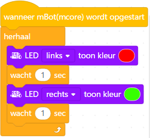
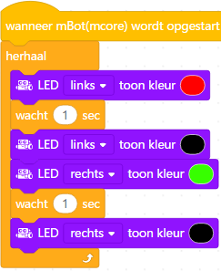
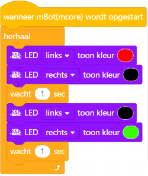

# Les 2: Blink Blink

In deze les gaan we met twee LEDs werken.

## 2.1 Blink Blink: beginprogramma, wie heeft gelijk?

 * Hieronder staan twee meningen van wat het programma eronder doet.
   Heeft de smiley met de zonnebril, of die met het strikje gelijk?

 | De linker en rechter LED gaan omstebeurt knipperen! Een disco!
:-------------:|:----------------------------------------: 

 | Rood gaat aan, groen gaat aan, rood gaat uit, groen gaat uit. Een looplicht!
:-------------:|:----------------------------------------: 

 | Eerst gaat rood aan, dan ook groen...? Saai!
:-------------:|:----------------------------------------: 

## 2.2 Blink Blink: beginprogramma, opdracht

 * Maak het programma en upload het programma

## 2.3 Blink Blink: beginprogramma, oplossing

De smiley met het strikje had gelijk! 
Nergens is de code zetten we een LEDje uit.
Daarom blijven de LEDs aan.

 | Ha!
:-------------:|:----------------------------------------: 

## 2.4 Blink Blink: disco, opdracht

Schrijf een programma:

 * de linker LED brandt rood
 * wacht een seconde
 * de rechter LED brandt groen
 * wacht een seconde
 * herhaal

 | Jippie, een disco!
:-------------:|:----------------------------------------: 

## 2.5 Blink Blink: disco, oplossing

Er zijn twee manieren, allebei zijn ze goed:

1|2
---|---
|

## 2.6 Blink Blink: looplicht, opdracht

Schrijf een programma:

 * de linker LED brandt rood
 * wacht een seconde
 * de linker LED brandt rood en de rechter LED brandt groen
 * wacht een seconde
 * de rechter LED brandt groen
 * wacht een seconde
 * alle LEDs zijn uit
 * wacht een seconde
 * herhaal

 | Jippie, een looplicht!
:-------------:|:----------------------------------------: 

## 2.7 Blink Blink: looplicht, oplossing

Ook hier zijn meer manieren, hier is een voorbeeld:

## 2.8 Blink Blink: eindopdracht

Schrijf een programma:

 * de linker LED brandt groen
 * wacht een seconde
 * alle LEDs zijn uit
 * wacht een seconde
 * de rechter LED brandt blauw
 * wacht een seconde
 * alle LEDs zijn uit
 * wacht een seconde
 * herhaal
