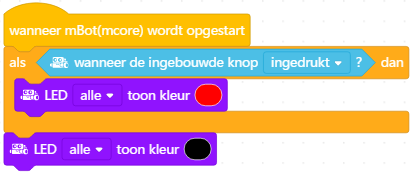

# Les 3: Knop

In deze les gaan we met de on-board drukknop werken.

## 3.1 Knop: beginprogramma, wie heeft gelijk?

 * Hieronder staan drie meningen van wat het programma eronder doet.
   Welke van de drie smileys heeft gelijk?

 | Als je de knop indrukt, gaan alle LEDs rood branden. Als je de knop loslaat, gaan alle LEDs uit.
:-------------:|:----------------------------------------: 

 | Als je de knop indrukt bij het opstarten, zie je even alle LEDs rood branden. 
:-------------:|:----------------------------------------: 

 | Als je de knop indrukt, gaan alle LEDs rood branden. Ook als je de knop weer loslaat.
:-------------:|:----------------------------------------: 

\pagebreak

## 3.2 Knop: beginprogramma, opdracht

 * Maak het programma en upload het programma

 | Het 'als ... dan' blok staat onder 'Besturen'
:-------------:|:----------------------------------------: 

 | Het 'wanneer de ingebouwde knop ...' blok staat onder 'Waarnemen'
:-------------:|:----------------------------------------: 

 | Met mijn zonnebril nemen mensen mij cooler waar!
:-------------:|:----------------------------------------: 

\pagebreak

## 3.3 Knop: beginprogramma, oplossing

De smiley met het strikje had gelijk! 
De code wordt een keer gedaan, want de code wordt niet herhaald.
De LEDs branden kort rood, want er wordt nooit gezegd te wachten.

 | Ha!
:-------------:|:----------------------------------------: 

## 3.4 Knop: als dan anders, opdracht

Schrijf een programma :warning: zonder te uploaden en zonder 'herhaal blok':warning::

 * **als** de ingebouwde knop ingedrukt is, **dan** branden de LEDs rood,
   **anders** branden de LEDs zwart

 | Nog niet je code uploaden!
:-------------:|:----------------------------------------: 

 | Gebruik geen 'herhaal' blok!
:-------------:|:----------------------------------------: 

 | Het 'als ... dan ... anders' blok staat onder 'Besturen'
:-------------:|:----------------------------------------: 

## 3.5 Knop: als dan anders, oplossing

## 3.6 Knop: als dan anders voorspellen, opdracht

:warning: Zonder de code te uploaden :warning::, wie van drie smileys
heeft volgens jou gelijk?

 | Als je de knop indrukt bij het opstarten, gaan alle LEDs eeuwig rood branden. Als je de knop niet indrukt bij het opstarten, gaan alle LEDs eeuwig uit. 
:-------------:|:----------------------------------------: 

 | Zo lang je de knop indrukt, gaan alle LEDs rood branden. Anders zijn all LEDs uit.
:-------------:|:----------------------------------------: 

 | Als je de knop indrukt bij het opstarten, gaan alle LEDs rood branden. Als je de knop loslaat, gaan alle LEDs uit. 
:-------------:|:----------------------------------------: 

## 3.7 Knop: als dan anders voorspellen, opdracht

De smiley met de zonnebril heeft gelijk!
De 'als ... dan ... ander' wordt een keer gedaan, bij het opstarten, daarna
is het programma klaar.

 | Ha!
:-------------:|:----------------------------------------: 

## 3.8 Knop: aanzetten met knop, opdracht

Schrijf een programma:

 * als de ingebouwde knop ingedrukt is, dan branden de LEDs rood,
   anders branden de LEDs zwart
 * herhaal dit eeuwig

## 3.9 Knop: aanzetten met knop, oplossing

## 3.10 Knop: lichteffect met knop, opdracht

Schrijf een programma:

 * Als de ingebouwde knop ingedrukt wordt, dan start een lichteffect.
 * Het lichteffect: eerst branden de LEDs een seconde groen, dan branden de
   LEDs een seconde blauw
 * Als tijdens het lichteffect de knop wordt losgelaten, wordt het effect gewoon
   eerst afgemaakt
 * Als de knop niet wordt ingedrukt, dan zijn de LEDs uit
 * Herhaal dit eeuwig

 | Dit kan met een 'Als ... dan' of met een 'Als ... dan ... anders' blok
:-------------:|:----------------------------------------: 

## 3.11 Knop: lichteffect met knop, oplossing

Dit kan op twee manieren:

1|2
---|---
|

## 3.12 Knop: eindopdracht

Schrijf een programma:

 * Als de ingebouwde knop niet ingedrukt wordt, dan start een lichteffect.
 * Het lichteffect: eerst branden de LEDs 0,1 seconde rood, dan gaan ze 0,1 seconde uit
 * Als tijdens het lichteffect de knop wordt ingedrukt, 
   wordt het effect gewoon eerst afgemaakt
 * Als de knop wel is ingedrukt, dan zijn de LEDs uit
 * Herhaal dit eeuwig

 | Tip: in mBlock schrijf je 0,1 seconde als 0.1 seconde
:-------------:|:----------------------------------------: 

 | Engelsen gebruiken een punt voor kommagetallen!
:-------------:|:----------------------------------------: 
