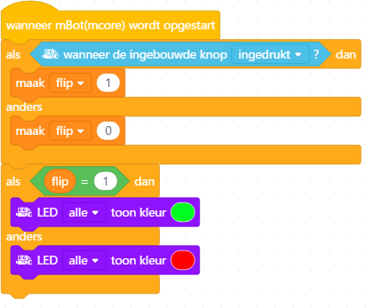
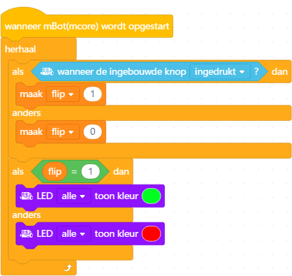
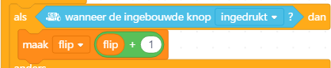
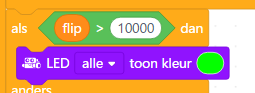

# Les 4: Knop opladen

In deze les gaan we met een knop 'opladen' en 'ontladen'.

## 4.1 Knop opladen: beginprogramma, wie heeft gelijk?

 * Hieronder staan drie meningen van wat het programma eronder doet.
   Welke van de drie smileys heeft gelijk?

 | Als je de knop indrukt, gaan alle LEDs groen branden. Als je de knop loslaat, gaan de LEDs rood branden.
:-------------:|:----------------------------------------: 

 | Als je de knop indrukt bij het opstarten, gaan alle LEDs groen branden. Ook als je de knop weer loslaat. Druk je de knop niet in, gaan de LEDs eeuwig rood branden
:-------------:|:----------------------------------------: 

 | Als je de knop indrukt bij het opstarten, zie je even alle LEDs eventjes groen branden. Anders zie je eventjes alle LEDs rood branden.
:-------------:|:----------------------------------------: 

## 4.2 Knop opladen: beginprogramma, opdracht

 * Maak het programma en upload het programma

 | Bij 'Variabelen' moet je klikken op 'Maak een Variabele'
:-------------:|:----------------------------------------: 

 | Maak de variabele met naam 'flip' voor alle sprites
:-------------:|:----------------------------------------: 

 | Goed idee: noem je volgende huisdier 'Variabele'!
:-------------:|:----------------------------------------: 

\pagebreak

## 4.3 Knop opladen: beginprogramma, oplossing

De smiley met de zonnebril had gelijk! 
De code wordt een keer gedaan, want de code wordt niet herhaald.
De LEDs blijven eeuwig branden, want ze worden nooit uitgezet.

 | Ha!
:-------------:|:----------------------------------------: 

## 4.4 Knop opladen: knopdetector, opdracht

Laat dit programma eeuwig herhalen.

Wie van de smileys heeft nu gelijk?

 | Als je de knop indrukt, gaan alle LEDs groen branden. Als je de knop loslaat, gaan de LEDs rood branden.
:-------------:|:----------------------------------------: 

 | Als je de knop indrukt bij het opstarten, gaan alle LEDs groen branden. Ook als je de knop weer loslaat. Druk je de knop niet in, gaan de LEDs eeuwig rood branden
:-------------:|:----------------------------------------: 

 | Als je de knop indrukt bij het opstarten, zie je even alle LEDs eventjes groen branden. Anders zie je eventjes alle LEDs rood branden.
:-------------:|:----------------------------------------: 

## 4.5 Knop opladen: knopdetector, oplossing
 

De gewone smiley had gelijk.

 | Ha!
:-------------:|:----------------------------------------: 

## 4.6 Knop opladen: flip verhoger, opdracht

 * Gebruik het blok onder de smileys om `flip` een hoger te maken.
 * Voorspel wat het programma gaat doen: welke van de smileys heeft gelijk?

 | Als je de knop indrukt, zie je een flits groen. Daarvoor en daarna branden de LEDs rood
:-------------:|:----------------------------------------: 

 | Als je de knop indrukt, branden de LEDs groen. Als de knop losgelaten is, branden de LEDs rood
:-------------:|:----------------------------------------: 

 | Als je de knop indrukt, gaan de LEDs vanaf dan eeuwig groen branden. Daarvoor branden de LEDs rood
:-------------:|:----------------------------------------: 

## 4.7 Knop opladen: flip verhoger, oplossing
 
De gewone smiley had gelijk.
Als je de knop indrukt, wordt `flip` een hoger (dus van een, naar twee, naar 
drie, en zo verder).
Alleen als `flip` precies een is, branden de LEDs groen.

 | Ha!
:-------------:|:----------------------------------------: 

## 4.8 Knop opladen: knop die oplaadt, opdracht

 * Voorander de tweede `Als ... dan` naar onderstaand blok.
   Het teken `>` lees je als 'groter dan'
 * Voorspel wat het programma gaat doen: welke van de smileys heeft gelijk?

 | Het teken `>` lees je als 'groter dan'
:-------------:|:----------------------------------------: 

 | Als je de knop lang genoeg indrukt, branden de LEDs eeuwig groen. Daarvoor branden ze rood.
:-------------:|:----------------------------------------: 

 | Als je de knop lang genoeg indrukt, branden de LEDs groen tot je de knop los laat. Daarvoor en daarna branden ze rood.
:-------------:|:----------------------------------------: 

 | Als je de knop tienduizend keer indrukt, gaan de LEDs groen branden. Dat is erg veel werk. Daarom branden de LEDs zo goed als eeuwig rood.
:-------------:|:----------------------------------------: 

## 4.9 Knop opladen: knop die oplaadt, oplossing
 
De smiley met zonnebril had gelijk.
Eerst branden de LEDs rood, want `flip` is lager dan tienduizend.
Als je de knop indrukt, wordt `flip` steeds een hoger (dus van een, naar twee, naar 
drie, en zo verder).
Als `flip` meer is dan tienduizend (een paar seconden!) worden de LEDs groen.
Door de knop los te laten, wordt `flip` weer nul en branden de LEDs weer rood.

 | Ha!
:-------------:|:----------------------------------------: 

 | Ik herhaal dit programma dus meer dan duizend keer per seconde.
:-------------:|:----------------------------------------: 

## 4.10 Knop opladen: eindopdracht

Schrijf een programma:

 * Als de knop is ingedrukt, wordt `flip` hoger
 * Als de knop los is, wordt `flip` lager
 * Als je de knop indrukt, branden de LEDs eerst rood, dan geel, dan groen: de
   knop wordt 'opgeladen'
 * Als je de knop loslaat en de LEDs waren groen ('opgeladen'), 
   dan 'ontladen' ze en branden na een tijdje weer geel en dan rood
 * Herhaal dit eeuwig

 | Het teken `<` lees je als 'kleiner dan'
:-------------:|:----------------------------------------: 

 | Tip: je hebt nu meer 'als' blokken nodig
:-------------:|:----------------------------------------: 
