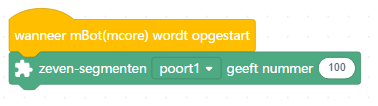

# Les 5: 7-segment display

In deze les gaan we met een 7-segment display gebruiken

## 5.1 7-segment display: extensiecentrum

Als je geen 'Makersplatform' blokken hebt, installeer deze:

 * Klik op de '+' onder de blokken

 * In het 'Extensie Centrum', zoek 'Makerplatform' en klik eronder op 'Toevoegen'

 

## 5.2 7-segment display: eerste getal, opdracht

 * Stop een 7-segment display in poort 1

 * Upload dit programma:

 * Wat zie je op het 7-segment display?

## 5.2 7-segment display: eerste getal, oplossing

Je ziet `100.0`, oftewel, in het Nederlands, 'honderd komma nul', oftewel
honderd.

 | Engelsen gebruiken een punt voor kommagetallen!
:-------------:|:----------------------------------------: 

## 5.3 7-segment display: tellen, opdracht

Maak een programma:

 * Maak een variabele aan met de naam `teller`
 * Herhaal eeuwig:

   * De 7 segment display laat de waarde van `teller` zien 
   * Verander `teller` met 1

Hoe lang duurt het ongeveer voor de teller over de duizend komt?

## 5.4 7-segment display: tellen, oplossing

Het duurt ongeveer 5 seconden voor de teller meer is dan duizend.

 | Het duurt ongeveer 5 seconden voor de teller meer is dan duizend
:-------------:|:----------------------------------------: 

## 5.5 7-segment display: tot tien tellen, opdracht

Maak een programma:

 * Maak een variabele aan met de naam `teller`
 * Herhaal eeuwig:

   * De 7 segment display laat de waarde van `teller` zien 
   * Verander `teller` met 1
   * Wacht 1 seconde
   * Als teller meer is dan 9, maak teller dan 1

 | Het is niet erg als je `1.000`, `2.000`, enzovoorts ziet
:-------------:|:----------------------------------------: 

## 5.6 7-segment display: tot tien tellen, oplossing

## 5.7 7-segment display: blok `verander_teller`, opdracht

Maak een blok:

 * Ga naar 'Mijn blokken' en klik op 'Maak een Blok'

 * Noem dit nieuwe blok `verander_teller`
 * In het blok `verander_teller` wordt `teller` met 1 verhoogd. 
   Als `teller` meer is dan 9, dan wordt `teller` 1 gemaakt
 * Het hoofdprogramma blijft hetzelfde doen:

   * De 7 segment display laat de waarde van `teller` zien 
   * Wacht 1 seconde
   * `verander_teller` wort gedaan

 | Blokken maak je code leesbaarder
:-------------:|:----------------------------------------: 

## 5.8 7-segment display: blok `verander_teller`, oplossing

## 5.9 7-segment display: blok `verander_teller`, opdracht

 * Maak een blok: `laat_teller_zien`
 * In het blok `laat_teller_zien` wordt de waarde van teller op
   het 7-segments display getoond
 * Het hoofdprogramma blijft eeuwig hetzelfde doen:
   * `laat_teller_zien` wordt gedaan
   * Wacht 1 seconde
   * `verander_teller` wort gedaan

## 5.10 7-segment display: blok `verander_teller`, oplossing

## 5.11 7-segment display: eindopdracht

 * Maak een blok: `effe_wachten`. Hierin wacht het programma 1 seconde
 * Maak een blok: `doe_eeuwig`. Hierin staat het programma: herhaal
   `laat_teller_zien`, dan `effe_wachten`, dan `verander_teller`
