# Les 6: RGB

In deze les gaan we met RGB waarden werken.

## 6.1 RGB: Start

 * Sluit een RGB module aan op poort 1
 
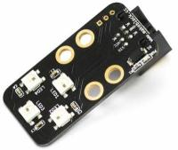

 * Maak onderstaand programma na:

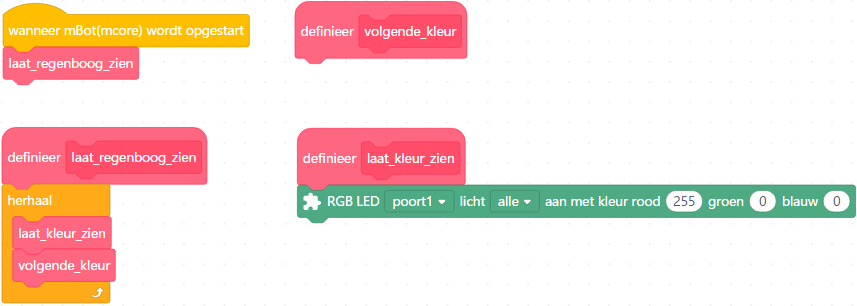

 | Het RGB blok staat onder 'Makersplatform'
:-------------:|:----------------------------------------:

 * Welke kleur denk je dat dit wordt?

## 6.2 RGB: Kleurencirkel, opdracht

 * Bekijk de kleurencirkel hieronder. Om geel te krijgen heb je
   rood en groen nodig.

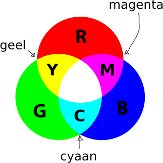

 * Verander `laat_zien`, zodat deze de kleur cyaan laat zien
   
 | Een rood, groen of blauwwaarde kan niet hoger zijn dan 255
:-------------:|:----------------------------------------:

\pagebreak
 
## 6.3 RGB: Kleurencirkel, oplossing

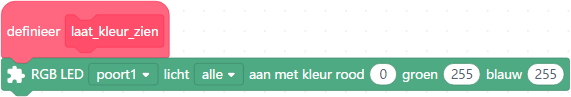

 | Vanaf nu zie je alleen het stuk van het programma dat veranderd is
:-------------:|:----------------------------------------:
 
 | Ha, meer ruimte voor ons om grapjes te maken!
:-------------:|:----------------------------------------:

## 6.4 RGB: Groenerer, opdracht

 * Maak een nieuwe variabele, `groen`
 * In `volgende_kleur`, maak `groen` steeds 1 hoger
 * In `laat_kleur_zien`, gebruik `groen` als de kleur groen (duh!). Gebruik
   het getal 0 voor de kleuren rood en blauw

Wat zie je? Het is misschien niet wat je verwacht!

 | Wat zie je? Het is misschien niet wat je verwacht!
:-------------:|:----------------------------------------:

\pagebreak
 
## 6.5 RGB: Groenerer, oplossing

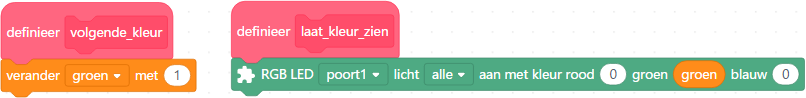

 | De LED wordt steeds groener, en gaat dan uit en begint overnieuw
:-------------:|:----------------------------------------:

## 6.6 RGB: Gelerer, opdracht

 * Maak een nieuwe variabele, `rood`
 * Wanneer de mBot wordt opgestart, zet `rood` op `255`
 * In `laat_kleur_zien`, gebruik `rood` als de kleur rood (duh!). 
   Gebruik nog steeds de variabele `groen` voor de kleur groen.
   Gebruik nog steeds het getal `0` voor de kleur blauw

Wat zie je? Het is misschien niet wat je verwacht!

 | Wat zie je? Het is misschien niet wat je verwacht!
:-------------:|:----------------------------------------:

\pagebreak
 
## 6.7 RGB: Gelerer, oplossing

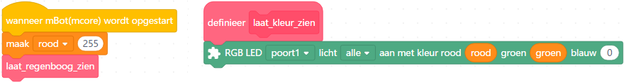

 | De LED gaat van rood naar geel, en begint dan overnieuw
:-------------:|:----------------------------------------:

## 6.8 RGB: RGB display, opdracht

 * Maak een derde variabele: `blauw`. Deze `variabele` doet nog niks
 * Verander `laat_kleur_zien`:

   * De RGB LED licht 1 laat zien: roodwaarde `rood`, groenwaarde `0` en blauwwaarde `0`
   * De RGB LED licht 2 laat zien: roodwaarde `0`, groenwaarde `groen` en blauwwaarde `0`
   * De RGB LED licht 3 laat zien: roodwaarde `0`, groenwaarde `0` en blauwwaarde `blauw`
   * De RGB LED licht 4 laat zien: roodwaarde `rood`, groenwaarde `groen` en blauwwaarde `blauw`

Wat zie je? Het is misschien niet wat je verwacht!

 | Wat zie je? Het is misschien niet wat je verwacht!
:-------------:|:----------------------------------------:

\pagebreak
 
## 6.9 RGB: RGB display, oplossing

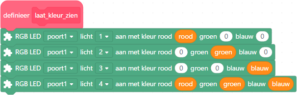

 | Een LED toont de rood, de tweede groen, de derde blauw, de vierde allemaal samen
:-------------:|:----------------------------------------:

## 6.10 RGB: regenboog stap 1, opdracht

 * Maak een vierde variabele: `stap`. 
 * Als de mBot wordt opgestart, zet `stap` op `1`
 * In `volgende_kleur`: als `stap` gelijk is aan `1`, doe dan twee dingen:
    * verander `groen` met `1`
    * als `groen` gelijk is aan `255`, zet `stap` op `2`
 * Maak een nieuw functieblok: `effe_wachten`. Hierin wordt 0,1 seconde gewacht
 * In `laat_regenboog_zien`, herhaal eeuwig `laat_kleur_zien`, `volgende_kleur`
   en nu ook `effe_wachten`

Wat zie je? Het is misschien niet wat je verwacht!

 | Wat zie je? Het is misschien niet wat je verwacht!
:-------------:|:----------------------------------------:

\pagebreak
 
## 6.11 RGB: regenboog stap 1, oplossing

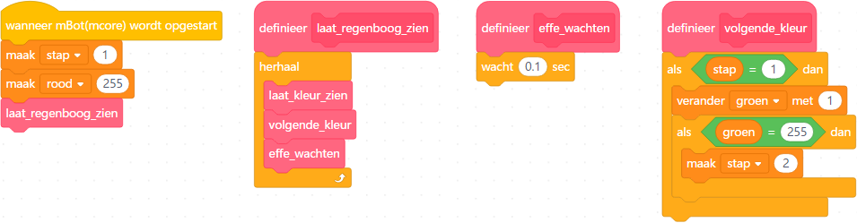

 | De eerste LED brandt rood en blijft rood
:-------------:|:----------------------------------------:

 | De tweede LED brandt zwart en wordt groen
:-------------:|:----------------------------------------:

 | De vierde LED brandt rood en wordt geel
:-------------:|:----------------------------------------:

## 6.12 RGB: regenboog stap 2, opdracht

 * In `volgende_kleur`: als `stap` gelijk is aan `2`, doe dan twee dingen:
    * verander `rood` met `-1`
    * als `rood` gelijk is aan `0`, zet `stap` op `3`
 * In `effe_wachten`: laat 0,03 seconden wachten, inplaats van 0,1

Wat zie je? Het is misschien niet wat je verwacht!

 | Wat zie je? Het is misschien niet wat je verwacht!
:-------------:|:----------------------------------------:

\pagebreak
 
## 6.13 RGB: regenboog stap 2, oplossing

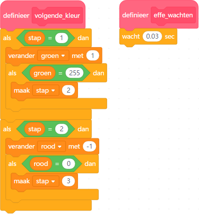

 | De eerste LED brandt een tijd rood en gaat dan uit
:-------------:|:----------------------------------------:

 | De tweede LED brandt zwart en wordt groen en blijft groen
:-------------:|:----------------------------------------:

 | De vierde LED brandt rood, wordt geel, dan blijft dan groen
:-------------:|:----------------------------------------:

## 6.14 RGB: regenboog stap 3, opdracht

 * Maak drie functieblokken: `volgende_kleur_1`, `volgende_kleur_2` 
   en `volgende_kleur_3`
 * In `volgende_kleur`: 
    * als `stap` gelijk is aan `1`, doe dan `volgende_kleur_1`
    * als `stap` gelijk is aan `2`, doe dan `volgende_kleur_2`
    * als `stap` gelijk is aan `3`, doe dan `volgende_kleur_3`
 * Verplaats de volgende code naar `volgende_kleur_1`: 
    * verander `groen` met `1`
    * als `groen` gelijk is aan `255`, zet `stap` op `2`
 * Verplaats de volgende code naar `volgende_kleur_2`: 
    * verander `rood` met `-1`
    * als `rood` gelijk is aan `0`, zet `stap` op `3`
 * Doe in `volgende_kleur_3`: 
    * verander `blauw` met `1`
    * als `blauw` gelijk is aan `255`, zet `stap` op `4`

Wat zie je? Het is misschien niet wat je verwacht!

 | Wat zie je? Het is misschien niet wat je verwacht!
:-------------:|:----------------------------------------:

\pagebreak
 
## 6.15 RGB: regenboog stap 3, oplossing

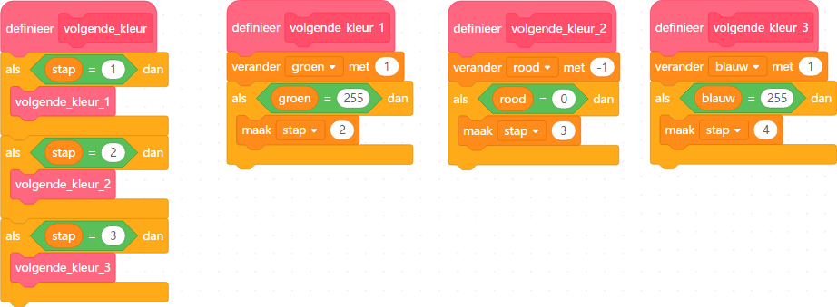

 | De eerste LED brandt een tijd rood en gaat dan uit
:-------------:|:----------------------------------------:

 | De tweede LED brandt zwart en wordt groen en blijft groen
:-------------:|:----------------------------------------:

 | De derde LED brandt zwart en wordt blauw en blijft blauw
:-------------:|:----------------------------------------:

 | De vierde LED brandt rood, wordt geel, dan groen, dan cyaan
:-------------:|:----------------------------------------:

## 6.16 RGB: eindopdracht

 * Maak drie nieuwe functieblokken: `volgende_kleur_4`, `volgende_kleur_5` 
   en `volgende_kleur_6`
 * Voeg toe aan `volgende_kleur`: 
    * als `stap` gelijk is aan `4`, doe dan `volgende_kleur_4`
    * als `stap` gelijk is aan `5`, doe dan `volgende_kleur_5`
    * als `stap` gelijk is aan `6`, doe dan `volgende_kleur_6`
 * Doe in `volgende_kleur_4`: 
    * verander `groen` met `-1`
    * als `groen` gelijk is aan `0`, zet `stap` op `5`
 * Doe in `volgende_kleur_5`: 
    * verander `rood` met `1`
    * als `rood` gelijk is aan `255`, zet `stap` op `6`
 * Doe in `volgende_kleur_6`: 
    * verander `blauw` met `-1`
    * als `blauw` gelijk is aan `0`, zet `stap` op `1`

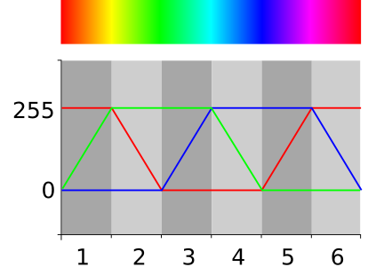
