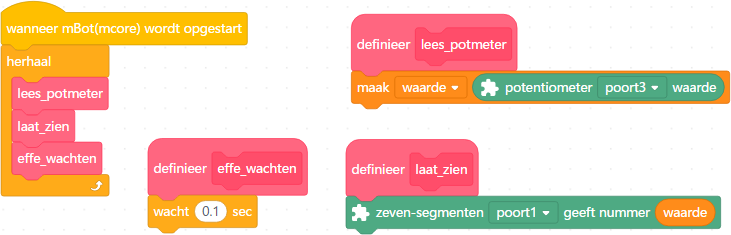
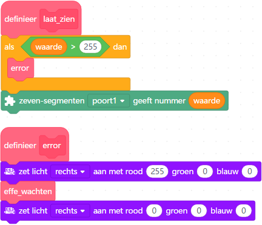
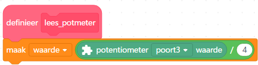
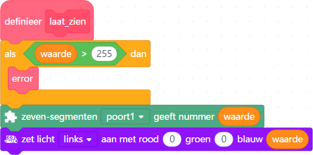

# Les 7: Potmeter

In deze les gaan we met een potmeter werken.

## 7.1 Potmeter: Start, opdracht

 * Sluit een potentiometer ('potmeter') module aan op poort 4
 * Sluit een 7 segment display aan op poort 1
 

 | 'potmeter' is een afkorting van 'potentiometer'
:-------------:|:----------------------------------------:

Schrijf het volgende programma:

 * Als de mBot wordt opgestart, doe dan eeuwig `lees_potmeter`, `laat_zien` en `effe_wachten`
 * Maak een variabele `waarde`
 * Maak een blok `lees_potmeter`, waarin `waarde` de waarde krijgt van de potentiometer
 * Maak een blok `laat_zien`, waarin het 7-segmenten display de waarde van `waarde` laat zien
 * Maak een blok `effe_wachten`, waarin 0,1 seconde gewacht wordt

Upload het programma en draai aan de potmeter. Welke getallen laat de 7-segmenten display zien?

\pagebreak

## 7.2 Potmeter: Start, oplossing

De 7-segmenten laat getallen tussen nul en 984 zien.

## 7.3 Potmeter: Error, opdracht

Een LEDje heeft een RGB waarde van ten hoogste 255. We laten de mBot 
een error geven als `waarde` boven de 255 komt.

 * In het blok `laat_zien`, voeg toe dat als `waarde` groter is dan 255, 
   dat dan het blok `error` wordt aangeroepen
 * Maak een blok `error`, deze zet de rechter LED op rood, doet dan `effe_wachten`, en zet dan de rechter LED weer op zwart

 | Het teken `>` lees je als 'groter dan'
:-------------:|:----------------------------------------: 

Draai aan de potmeter. Wat zie je gebeuren?

\pagebreak

## 7.4 Potmeter: Error, oplossing

Het rechter rode LEDje gaat knipperen als de 7-segment display boven de 255 komt.

## 7.5 Potmeter: Delen, opdracht

In `lees_potmeter`, wordt nu `waarde` gelijk gemaakt aan de waarde van de potmeter.
De hoogste waarde van de potmeter is te hoog voor ons:

Verander in het programma:

 * In `lees_potmeter`, zet `waarde` gelijk aan de waarde van de potmeter gedeeld door 4

Upload je code en kijk of er geen error meer is. Wat is de hoogste waarde
die nu op de 7-segment display komt?
 
 | Het teken `/` lees je als 'gedeeld door'
:-------------:|:----------------------------------------: 

\pagebreak

## 7.6 Potmeter: Delen, oplossing

 | Huh? Was dat alles?
:-------------:|:----------------------------------------:

 | De '/' herken je misschien van breuken: 1/2 is een half!
:-------------:|:----------------------------------------:

## 7.7 Potmeter: Blauwerer, opdracht

Maak een programma dat:

 * In `laat_zien` de `waarde` laat zien als de blauwwaarde van de linker LED

 | Leuk! `laat_zien` laat meerdere dingen `waarde` zien!
:-------------:|:----------------------------------------:

\pagebreak

## 7.8 Potmeter: Blauwerer, oplossing

 | Op de potmeter zit een lampje dat precies hetzelfde doet!
:-------------:|:----------------------------------------:

## 7.9 Potmeter: eindopdracht met afstandssensor

Maak een programma dat:

 * Sluit de ultrasone afstandssensor aan.

 * Verander de naam `lees_potmeter` naar `lees_afstand`
 * In `lees_afstand` maak `waarde` 25 keer de waarde van de ultrasone sensor 
 * In `lees_afstand`, als `waarde` meer is dan 255, zet waarde dan op `255`

 | Het teken `*` lees je als 'keer'/'maal'/'vermenigvuldigd met'
:-------------:|:----------------------------------------: 
