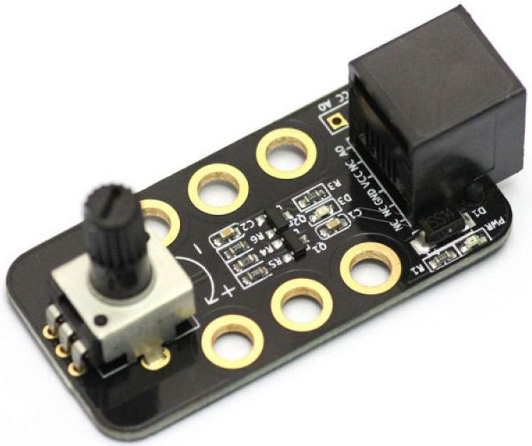

# Les 7: Potmeter

In deze les gaan we met een potmeter werken.

## 7.1 Potmeter: Start

 * Sluit een potentiometer ('potmeter') module aan op poort 4
 

 | Deze les is nog niet af
:-------------:|:----------------------------------------:

